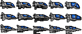
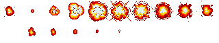
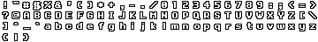
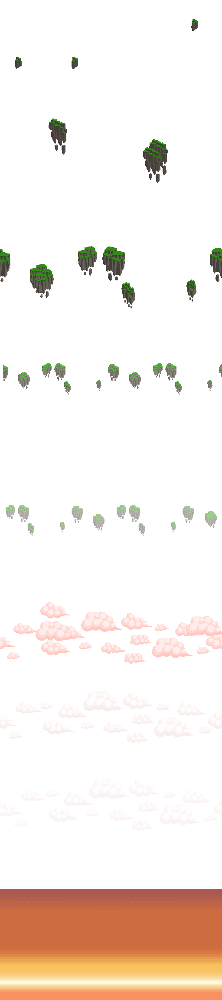

# Side-Scroller Shoot 'Em Up

A retro side-scrolling shooter game. Blast asteroids, collect power-ups, and survive as long as you can!

## Gameplay
- **Move:** Arrow keys
- **Shoot:** Space Bar
- **Collect Power-Ups:** Grab powerups to enhance your weapons and abilities.

---

### Player Craft

- The player's spaceship, animated as it moves and shoots.

### Explosion

- Explosion animation played when enemies or the player are destroyed.

### Power-Up

- Each frame represents a different bonus: extra bullets, rockets, shield, speed, or build power.

### Font

- Bitmap font used for score and in-game text.

### Background

- Used a side scroller parallax background for the game.

---

## Sounds

### Laser Fire
- **File:** `assets/sounds/Retro_8-Bit_Game-Gun_Laser_Weapon_Shoot_Beam_07.wav`
- **Use:** Played when the player shoots.

### Enemy Explosion
- **File:** `assets/sounds/Retro_8-Bit_Game-Bomb_Explosion_08.wav`
- **Use:** Played when an enemy is destroyed.

### Player Explosion
- **File:** `assets/sounds/Retro_8-Bit_Game-Bomb_Explosion_02.wav`
- **Use:** Played when the player is destroyed.

### Background Music
- **File:** `assets/sounds/space-asteroids.ogg`
- **Use:** Looped as the main background music during gameplay.

#### Inspired by https://ansimuz.itch.io/warped-space-shooter